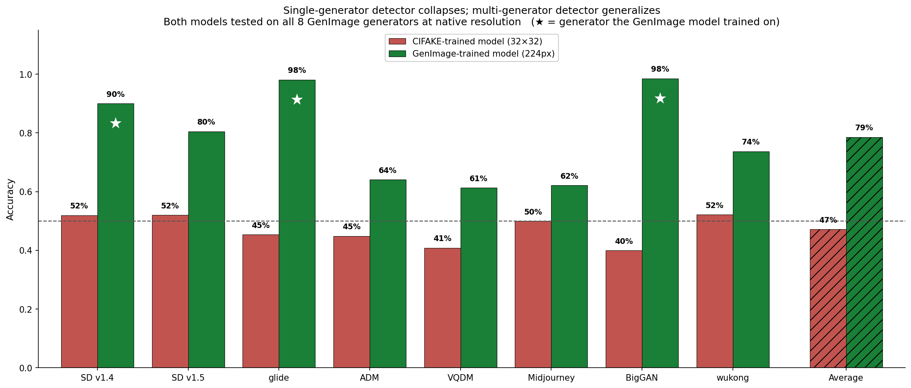

# Discerning the Synthetic
*Cross-generator detection of AI-generated images, with an interactive human-vs-model game.*

**[▶ Play the game in your browser](https://lwurtzel.github.io/Discerning-the-Synthetic/)**

*A detector trained on a single generator collapses to chance on unseen generators (red); a detector trained across multiple generators generalizes far better (green). ★ marks generators the given model trained on.*

## Repository contents
- **`CIFAKE_CNN.ipynb`** — notebook used to train a CNN on the CIFAKE dataset (single-generator baseline).
- **`Genimage_CNN.ipynb`** — note book used to train a ResNet50V2 CNN across multiple GenImage generators.
- **`spot_the_ai_game_all_generators.ipynb`** — the human-vs-model game as a self-contained notebook (auto-downloads the model and images).
- **`docs/`** — the browser-based game (served via GitHub Pages).
- **`cifake_vs_genimage_generalization.png`, `cifake_to_genimage_collapse.png`** — result figures.
- **Analysis figures** — `confusion_matrix.png` (2×2: the model is cautious, catching only about 61% of fake images but 96% of real images), `source_breakdown.png` (9×2 per-generator: fakes from unseen generators like ADM/VQDM/Midjourney slip through the most often), and `gradcam.png` (interpretability: the detector attends to the rendered subject, not the background). Discussed in detail in the slides.
- **Slides** — presentation covering the problem, approach, and findings.

## Models
The trained CNNs are attached as assets under **[Releases](https://github.com/LWurtzel/Discerning-the-Synthetic/releases)** (too large for the repo). The notebooks and the website download them automatically.

## Datasets
- **CIFAKE** — [kaggle.com/datasets/birdy654/cifake-real-and-ai-generated-synthetic-images](https://www.kaggle.com/datasets/birdy654/cifake-real-and-ai-generated-synthetic-images)
- **GenImage** — [github.com/GenImage-Dataset/GenImage](https://github.com/GenImage-Dataset/GenImage) · per-generator Kaggle mirror: [github.com/vtphatt2/GenImage-mirror](https://github.com/vtphatt2/GenImage-mirror)

---
*Claude Opus 4.8 assisted in creating several of the games, figures, and the GenImage model.*
