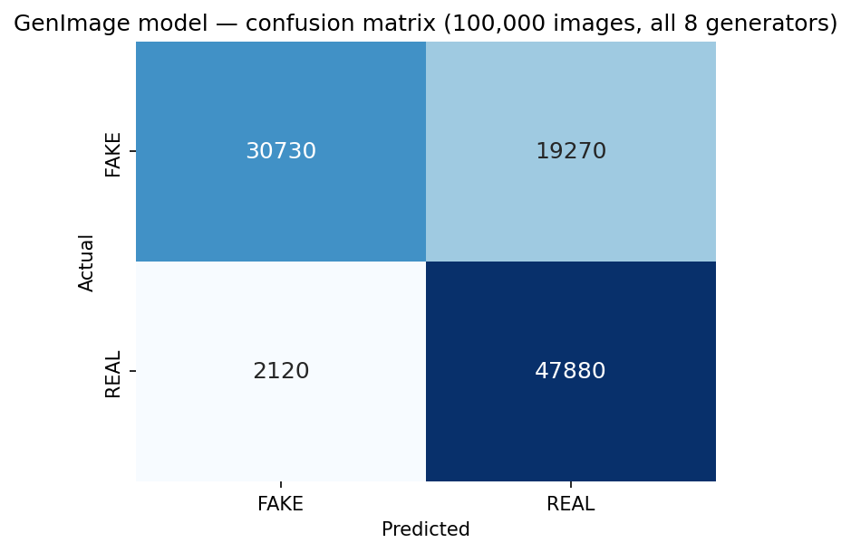
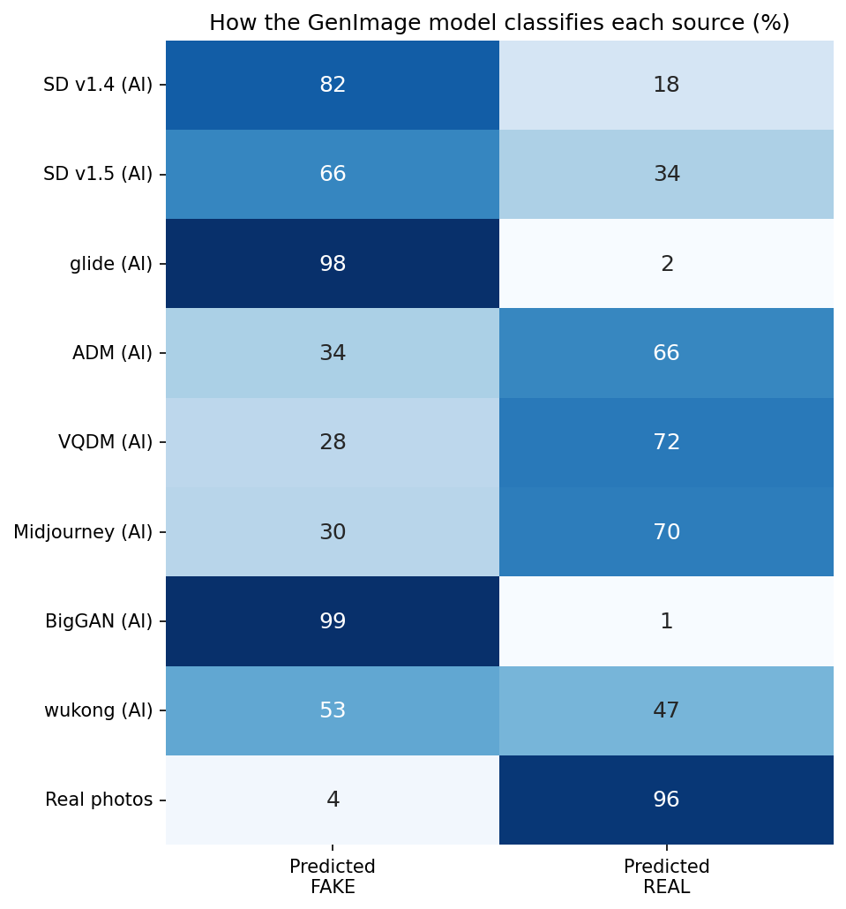
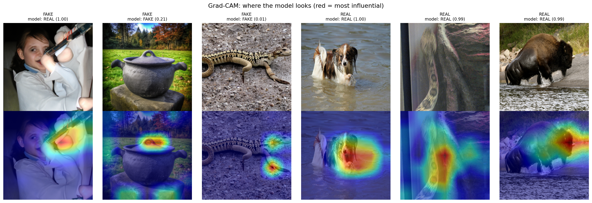

# Discerning the Synthetic

*Can a neural network tell real photos from AI-generated images — even from generators it has never seen?*

**[▶ Play the human-vs-model game in your browser](https://lwurtzel.github.io/Discerning-the-Synthetic/)**

*A detector trained on a single generator (red) collapses to chance on generators it never saw; a detector trained across multiple generators (green) generalizes far better, though it still dips significantly on unseen generators. ★ marks the generators each model was actually trained on.*

---

## TL;DR

I built two "AI-image detectors" and stress-tested how well they **generalize to image generators they were never trained on**, which is what actually matters, since new AI image generators appear constantly.

- A from-scratch CNN trained on **CIFAKE** (one generator, Stable Diffusion 1.4) reaches **~95% accuracy** on held-out data from that same generator — but that accuracy **collapses to ~47% (worse than guessing) on eight other generators.** It learned one generator's fingerprint, not a general idea of what is "AI-generated."
- A **ResNet50V2** transfer-learning model trained across **three** generators from the larger **GenImage** dataset generalizes much better — **~79% macro average accuracy across all eight generators** — but still reaches lower accuracies on the generators it didn't train on.
- The failure is **systematic, not random:** the stronger model is cautious. It gets **96% of real photos correct**, but catches only **~61% of fakes**, and the fakes it misses come overwhelmingly from **unseen generators** which it labels "real."
- You can trade off which errors it makes by moving the decision threshold, but **generalization across generators is the real challenge, not raw accuracy on one.**
- The Grad-CAM image showcases the parts of the image that the model focuses on to make decisions; mainly the main subject and not the background.

---

## Motivation

Modern image generators such as Stable Diffusion, Midjourney, DALL·E, and many other new ones, are able to produce images that most people cannot flag by eye. A detector that only recognizes the specific generator it was trained on is close to useless in practice, because the generator that matters tomorrow is one that didn't exist yesterday.

So the question this project asks is not "can a CNN reach high accuracy on a fixed dataset?" (it can, easily) but **"does that accuracy survive contact with a generator the model has never seen?"** That single shift from in-distribution accuracy to **cross-generator generalization** is the whole story.

---

## Approach

**Two datasets, two models, one test.**

| | Dataset | Model | Trained on | Tested on |
|---|---|---|---|---|
| **Baseline** | CIFAKE (32×32) | CNN from scratch | Stable Diffusion 1.4 only | all 8 GenImage generators |
| **Stronger** | GenImage (224px) | ResNet50V2 transfer learning | SD 1.4, glide, BigGAN | all 8 GenImage generators |

The experimental idea is the same for both: **train on some generators, evaluate on generators held out entirely from training.** The gap between in-distribution and out-of-distribution accuracy is the measure of generalization.

Everything was built with **TensorFlow / Keras**, using a cached `tf.data` input pipeline, and trained on a **Google Colab T4 GPU**.

---

## Findings

### 1. A single-generator detector works, but then collapses

The CIFAKE-trained CNN scores **95.1%** on held-out CIFAKE images (Stable Diffusion 1.4). Pointed at eight other generators it never saw, its accuracy falls to a **~47% average — at or below chance.** A detector that does worse than a coin flip on unseen generators has not learned "what AI images look like"; it has memorized the fingerprint of one generator.

### 2. Training across generators generalizes better

See the header figure. Retraining a **ResNet50V2** across three generators (SD 1.4, glide, BigGAN — marked ★) lifts accuracy on **every** generator relative to the CIFAKE model, reaching **~79% average across all eight.** The trained generators are near-ceiling (90–98%); the story is the **unseen** generators — still well above the old model and above chance, but clearly lower (ADM 64%, VQDM 61%, Midjourney 62%). Generalization improved, but was not solved.

### 3. How it fails: it defaults to "real"

  
  

Across 100,000 validation images, the GenImage model is **cautious**: it is correct on **96% of real photos** but catches only **~61% of fakes.** The per-generator breakdown (right) shows *why* — fakes from the generators it never trained on (**ADM, VQDM, Midjourney**) are misclassified as "real" roughly **70% of the time.** When the model is unsure, it guesses "real," so unseen generators slip through.

### 4. The lever: the decision threshold

Because missed fakes get labeled "real," raising the bar for a "real" verdict catches more fakes — at a cost to real-photo accuracy. There is no free lunch:

| Threshold | Fakes caught | Reals correct | Overall |
|---|---|---|---|
| 0.50 (default) | 64% | 96% | ~80% |
| 0.80 | 77% | 88% | ~82% |

Tuning the threshold picks **which errors you make**; it does not teach the model anything new about unseen generators.

### 5. What is it looking at?

Grad-CAM highlights the pixels that drove each prediction. The detector attends to the **rendered subject itself** — the object's textures and edges — rather than the background, reading generation artifacts in how the object was drawn. (This is a nice contrast with the low-resolution CIFAKE literature, which found background cues mattered more at 32×32.)

---

## Repository contents

Everything needed to reproduce the results, run the demo, and read the analysis.

### Notebooks

- **`CIFAKE_CNN.ipynb`** — Trains the single-generator baseline: a convolutional neural network built and trained from scratch on the CIFAKE dataset (60k real CIFAR-10 images + 60k Stable Diffusion 1.4 fakes, 32×32). Covers the data pipeline, model definition, training loop, the ~95% in-distribution result, and the cross-generator evaluation that produces the collapse figure.
- **`Genimage_CNN.ipynb`** — Trains the stronger model: a ResNet50V2 transfer-learning classifier on the GenImage dataset at 224px, trained across three generators and evaluated on all eight. Also contains the analysis that generates the confusion matrix, the per-generator source breakdown, the threshold-tradeoff sweep, and the Grad-CAM interpretability panels.
- **`spot_the_ai_game_all_generators.ipynb`** — A self-contained version of the human-vs-model game as a notebook. It auto-downloads the trained model and a set of sample images from the GitHub Release, then lets a person guess real vs. fake alongside the model's prediction, tallying both scores.

### Browser game — `docs/`

Served via GitHub Pages at **[lwurtzel.github.io/Discerning-the-Synthetic](https://lwurtzel.github.io/Discerning-the-Synthetic/)**. Runs entirely in the browser with no install and no server.

- **`docs/index.html`** — The game. Loads the model with **TensorFlow.js** and runs inference **on-device**. Each play is 10 rounds drawn from a balanced pool of real and AI images; you and the model both guess, and it keeps score. Images from generators the model *trained* on vs. ones it *didn't* are flagged in the reveal, so you can watch its accuracy drop on unseen generators.
- **`docs/model/`** — The TensorFlow.js graph model (converted from the Keras model) plus its weight shards.
- **`docs/images/`** — The sample images the game serves.
- **`docs/manifest.json`** — Index of the game images with their true labels and source generator.

### Result & analysis figures

- **`cifake_vs_genimage_generalization.png`** — The headline comparison: CIFAKE model (red) vs. GenImage model (green) on all eight generators, with the trained generators starred.
- **`cifake_to_genimage_collapse.png`** — The CIFAKE model alone, showing the 95% → ~47% collapse on unseen generators.
- **`simple_confusion_matrix.png`** — 2×2 confusion matrix for the GenImage model over 100k validation images (cautious: 96% of reals correct, ~61% of fakes caught).
- **`source_breakdown.png`** — Per-generator breakdown of how each source is classified; shows unseen fakes slipping through as "real."
- **`threshold_tradeoff.jpg`** — Fake-catch rate vs. real-photo accuracy as the decision threshold sweeps from 0.5 to 1.0.
- **`gradcam.png`** — Grad-CAM interpretability panels showing where the model looks.

### Other

- **`LICENSE`** — MIT for the original code; note that the GenImage-derived images and model retain their source license (CC BY-NC-SA, non-commercial). See the file for details.
- **`Slides.pptx`** — the capstone presentation deck (see [Presentation](#presentation)).

### Models — [Releases](https://github.com/LWurtzel/Discerning-the-Synthetic/releases)

The trained CNNs are too large for the repo and are attached as assets on the Releases page. The notebooks and the website download them automatically, so you normally don't need to fetch them by hand.

---

## Reproduce it yourself

1. **Get the data.** Download CIFAKE and/or the GenImage validation mirror from the links under [Datasets](#datasets). The notebooks expect a Kaggle API key; credentials are read at runtime (never commit `kaggle.json`).
2. **Open the notebook** in Google Colab (recommended — free T4 GPU) or locally with a TensorFlow environment. Set the runtime to GPU.
3. **Run top to bottom.** `CIFAKE_CNN.ipynb` reproduces the baseline and the collapse figure; `Genimage_CNN.ipynb` reproduces the stronger model and all the analysis figures.
4. **Try the game** with no setup at the [live site](https://lwurtzel.github.io/Discerning-the-Synthetic/), or run `spot_the_ai_game_all_generators.ipynb` for the notebook version.

---

## Datasets

- **CIFAKE** — 60k real (CIFAR-10) + 60k Stable Diffusion 1.4 fakes at 32×32. [kaggle.com/datasets/birdy654/cifake-real-and-ai-generated-synthetic-images](https://www.kaggle.com/datasets/birdy654/cifake-real-and-ai-generated-synthetic-images)
- **GenImage** — eight generators (SD 1.4, SD 1.5, glide, ADM, VQDM, Midjourney, BigGAN, wukong) plus real photos, at native resolution. [github.com/GenImage-Dataset/GenImage](https://github.com/GenImage-Dataset/GenImage) · per-generator Kaggle mirror: [github.com/vtphatt2/GenImage-mirror](https://github.com/vtphatt2/GenImage-mirror)

---

## Limitations & future work

- **Generalization, not accuracy, is the bottleneck.** The model is strong on generators it trained on and mediocre on ones it didn't. Closing that gap — by fine-tuning on more generators and adding newer ones (SDXL, DALL·E 3, Flux) — is the obvious next step.
- **Clean-image evaluation.** These results are on relatively clean images. Real-world images are compressed, resized, and re-saved; a robustness study (and adversarial stress-testing) would show how much of this accuracy survives.
- **Calibration.** The model's confidence isn't calibrated, which is why a single threshold is a blunt instrument. Better-calibrated outputs would make deployment (e.g., as a browser extension) more trustworthy.

---

## Presentation

The capstone talk walks through the same story — problem, approach, the collapse-and-generalize arc, the failure analysis, and a live demo of the game. See **`Slides.pptx`** in this repo.

---

## Acknowledgements

Datasets courtesy of the CIFAKE and GenImage authors (see Datasets).

Claude (Anthropic) acted as a coding and design collaborator throughout the project. Its help included: shaping the cross-generator generalization experiment; debugging the `tf.data` input pipeline and training setup; producing the analysis figures (the comparison chart, collapse plot, confusion matrix, per-generator source breakdown, threshold-tradeoff sweep, and Grad-CAM panels); assisting the building of the interactive human-vs-model games and the TensorFlow.js browser deployment; helping design and build the capstone presentation deck; and contributing this README. All model training, decisions, and final review were done by the author.
